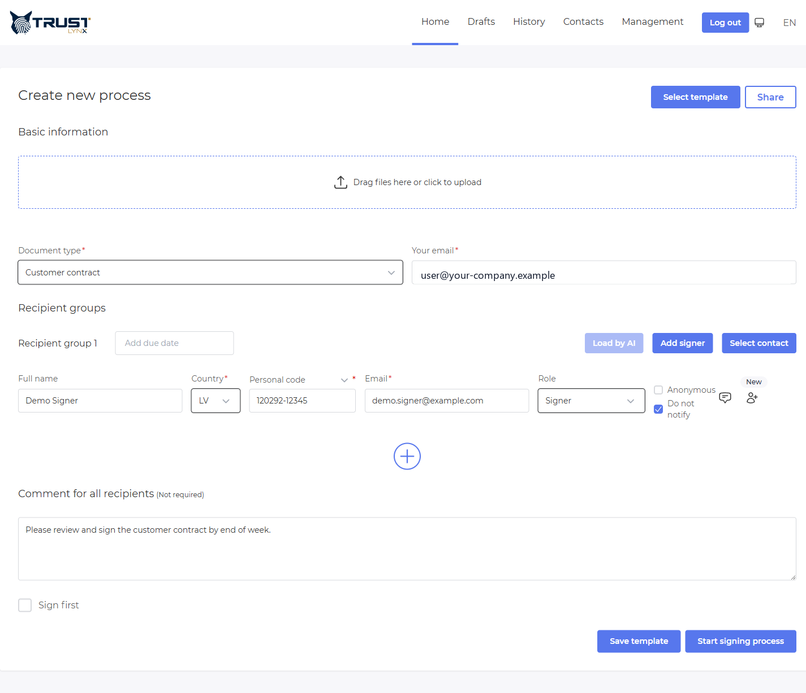

# SignBox internal portal - URL integration guide

This guide is for **client development teams** integrating a third-party system with TrustLynx **SignBox internal portal**: your user stores a document in the **archive**, opens the portal via a **link you build**, completes signing setup in the browser, and can return to your application.

For **starting signing processes from your own backend** (no portal UI), use the same API contract described here:

**[Process Service integration (JSON API)](https://github.com/mihailsgo/trustlynx-signbox-process-integration)** - `POST /api/process`, process lookup, mass launch patterns, and field reference.

---

## Other SignBox integration styles (not covered here)

| Guide | What it is for |
|--------|----------------|
| **[Process Service integration](https://github.com/mihailsgo/trustlynx-signbox-process-integration)** | Server-side or automated creation of signing **processes** (workflow, multiple signers, document id from archive). |
| **[Pure signing integration](https://github.com/mihailsgo/trustlynx-signing-integration)** | Simpler flow: put document in archive → call API to obtain a **redirect URL** → user signs on the signing page (e.g. Smart-ID) → return to your system and download the signed file. **This is not the internal-portal approach**; see that repository for steps and endpoints. |
| **This document** | Open the **internal portal** with query parameters so operators use SignBox’s full **create process** experience (profiles, signers, preview) against an **archive document id**. |

---

## 1. What you need from TrustLynx

Before development, confirm with your TrustLynx contact:

- **Internal portal base URL** (example: `https://signbox-internal.yourcompany.com`).
- How your users **sign in** (typically corporate identity / Keycloak).
- The **archive document id** returned after upload (same value SignBox uses to attach a process to an existing file).
- Allowed values for **`documentType`** in pre-filled data - this is your tenant’s **document profile id** (often a UUID or technical key), not only a display name. Wrong or unknown profile ids cause validation errors when starting the process.
- Optional: **`returnurl` / `redirectUrl` allow-list** rules if your security team requires it.

---

## 2. Storing the file in the archive (prerequisite)

The internal portal link uses query parameter **`id`**. That value must be the **archive document id** returned when your backend stores the file in SignBox archive.

**Full step-by-step** (obtain access token, multipart upload, `documentData` query shape, response fields, code samples) is documented in the **pure signing integration** guide:

| Step | Topic | Link |
|------|--------|------|
| 1 | Get Keycloak (OAuth) access token | **[1) Get Keycloak Token](https://github.com/mihailsgo/trustlynx-signing-integration#1-get-keycloak-token)** |
| 2 | Upload PDF - `POST …/api/document/create` with multipart `file` and `documentData` | **[2) Upload PDF with Document Create API (multipart)](https://github.com/mihailsgo/trustlynx-signing-integration#2-upload-pdf-with-document-create-api-multipart)** |

After a successful upload, use the **`id`** field from the JSON response (example in that guide: `545963a4-3dc5-46b1-b64a-f2d292f9f37e`) as **`id`** in your portal URL.

**Important:** The same repository also describes **redirect URL**, **external signing page**, and **download** for the *pure signing* journey. For **internal portal** integration you only need **token + archive create** (sections **1** and **2** above); you do **not** need the redirect-to-signing-page steps unless you are implementing that separate product flow.

Base URLs (`AUTH_BASE_URL`, `ARCHIVE_BASE_URL`, realm, client id) in that guide are **examples** - your TrustLynx project supplies production values.

---

## 3. How the flow works (after you have an archive id)

1. Your **backend** has uploaded the file and received **`documentId`** from the archive (see [section 2](#2-storing-the-file-in-the-archive-prerequisite)).
2. Your **frontend** sends the user’s browser to the internal portal with that id in the query string (and optional return links or pre-filled data).
3. The user **logs in** to the portal.
4. The portal loads the document from the archive, shows the **create process** screen, and the user adds or confirms signers, deadlines, and options.
5. The user starts the process from the portal. Depending on configuration, the user may be sent back via **`returnurl`** or a response-driven redirect.

No access to SignBox source code is required - only URLs, parameters, and (for advanced use) the JSON shape below.

---

## 4. Portal addresses you will use

Replace `{portal}` with your internal portal base URL (no trailing slash required if your app tolerates it; prefer consistency with your environment).

| Address | Purpose |
|---------|---------|
| `{portal}/` | **Create signing process** (main screen). |
| `{portal}/eseal` | Create process with **e-seal** oriented defaults (same query parameters as `/`). |
| `{portal}/history` | List of processes (mainly for portal users). |
| `{portal}/history/{processId}` | **Details of one process**. `{processId}` is the **SignBox process id** returned when a process is created - not the archive document id. |

### Critical distinction

- Query parameter **`id`** on **`/`** or **`/eseal`** = **archive document id** (from archive after upload).
- Path **`/history/{processId}`** = **signing process id** (workflow instance).

---

## 5. Query parameters on create screens (`/` and `/eseal`)

Build links as normal HTTPS URLs with a query string. **Encode** values that contain `&`, `?`, spaces, or non-ASCII characters (use your platform’s URL encoder).

| Parameter | Required | Description |
|-----------|----------|-------------|
| **`id`** | No | **Archive document id.** When present, the portal assumes the file already lives in the archive: it **does not** ask the user to upload a file again. It shows container information and links the new process to this document. |
| **`returnurl`** | No | **Full URL** (https://…) back to your application. The portal shows a **persistent “return” control** and may pass this value to the backend when the process is created. If SignBox responds with a redirect location, the browser may navigate there instead of only showing a success message - behaviour depends on your environment. |
| **`redirectUrl`** | No | **Full URL** used for the portal’s **Cancel** action only. It does **not** replace `returnurl` for the return ribbon. Use it when “cancel” should go somewhere different from “success return”. |
| **`data`** | No | **Optional.** Base64-encoded JSON that **pre-fills** the create form (signers, comment, document profile, flags, etc.). See [section 7](#7-data-parameter--json-examples). Usually combined with **`id`** so the file comes from the archive while steps and participants are pre-populated. |

### Example links

**Open create screen with archive document and return to your case page:**

```text
https://{portal}/?id=545963a4-3dc5-46b1-b64a-f2d292f9f37e&returnurl=https%3A%2F%2Fhr.example.com%2Fcases%2FCASE-2026-001
```

**Same, but Cancel sends the user to a search page:**

```text
https://{portal}/?id=545963a4-3dc5-46b1-b64a-f2d292f9f37e&returnurl=https%3A%2F%2Fhr.example.com%2Fcases%2FCASE-2026-001&redirectUrl=https%3A%2F%2Fhr.example.com%2Fresignations
```

**Open an existing process for monitoring (use process id from API or portal):**

```text
https://{portal}/history/0b2e2d71-3ddd-4f42-8904-c43eb7d0c3fd
```

---

## 6. What you cannot pass as separate query fields

- **Individual signers** are not separate URL parameters like `signer1=…`. Use either the **`data`** JSON (below), or let the user type them in the portal, or use **[Process Service API](https://github.com/mihailsgo/trustlynx-signbox-process-integration)** to create the process entirely from your backend.
- There is **no** `documentType=…` query parameter on these routes: put document profile in **`data`** or let the user pick it in the UI.
- **Process id** does not pre-load the create form; use **`/history/{processId}`** to open an existing process.

---

## 7. `data` parameter - JSON examples

The portal expects **`data`** to be **standard Base64** encoding of a **UTF-8 JSON** string.

- In **JavaScript** in the browser, raw `btoa(json)` only works if the JSON is ASCII-only. For names/comments with letters like **ā, ü, 中文**, use UTF-8 safe encoding, for example:

 ```javascript
 const json = JSON.stringify(payload);
 const data = btoa(unescape(encodeURIComponent(json)));
 const url = `https://{portal}/?id=${encodeURIComponent(documentId)}&data=${encodeURIComponent(data)}`;
 ```

- Keep payloads **small**. Very long URLs can be blocked by browsers or proxies. For heavy automation, prefer **[Process Service API](https://github.com/mihailsgo/trustlynx-signbox-process-integration)** or **`id`** without `data`.

### Process Service vs `data` JSON

The **[Process Service integration](https://github.com/mihailsgo/trustlynx-signbox-process-integration)** documents the JSON the service **stores**: each step signer includes fields such as **`signerName`**, **`signerEmail`**, **`signerPersonalCode`**, **`signerCountry`**, **`signerRole`**, **`commentForSigner`**, **`signerLanguage`**, etc. **There is no signer `method` field in that model** - Process Service does not persist or validate `PHONE` / `PERSONALCODE`.

The **`data` query value** only pre-fills the **internal portal browser form**. That form uses extra keys (including **`method`**) so the UI can treat **`personal`** as either a **phone number** or a **national personal code** input. When the operator submits, the portal maps the form to the Process Service shape; **`method` is not sent** to the process API.

**Which `method` is correct?** It must **match what you put in `personal`**: use **`PERSONALCODE`** when `personal` is a **national personal code** (like the Latvian-style values in the examples below). Use **`PHONE`** when `personal` is a **mobile number** in the format your portal expects. Both strings are uppercase. Process Service still only stores the resulting value as **`signerPersonalCode`**.

**Practical takeaway:** for **server-side** integration, follow the Process Service guide and ignore `method`. For **URL + `data`** integration, keep the examples as-is (they mirror the portal form), or skip `data` and use **`id` only** so signers are entered entirely in the UI.

### 7.1 JSON shape (reference)

All examples share the same overall structure:

| Field | Type | Notes |
|-------|------|--------|
| `signFirst` | boolean | Signing order behaviour for your tenant configuration. |
| `comment` | string | Process-level comment. |
| `documentName` | string | Display name; with **`id`** set, the portal may still refresh name from archive metadata when available. |
| `documents` | array | Always **`[]`** when using **`id`** (file is not uploaded from the form). |
| `isAsice` | boolean | Container format preference where applicable. |
| `processInitiatorEmail` | string | Email of initiating party (often overwritten by logged-in user when they open the link). |
| `documentType` | string | **Your document profile id** from TrustLynx configuration. |
| `groups` | array | Signing **steps**. Each item has `dueDate` (`null` or ISO-8601 string) and `signers` (array). |
| `addeseal` | boolean | Whether e-seal options apply in your environment. |
| `mergePdfs` | boolean | Relevant when multiple PDFs are merged (usually `false` with archive `id`). |
| `eSealOnly` | boolean | Use `false` on `/` for normal signing; `/eseal` flow typically uses `true`. |

Each **signer** object:

| Field | Example | Notes |
|-------|---------|--------|
| `name` | `"Jane Employee"` | Full name. |
| `email` | `"jane.employee@example.com"` | Required for notifications. |
| `country` | `"LV"` | ISO country code as configured for your tenant. |
| `personal` | `"120292-12345"` | Value for **personal code** or **phone** (format depends on portal UI); maps to **`signerPersonalCode`** on the API. |
| `role` | `"SIGNER"` | Common values: **`SIGNER`**, **`APPROVER`**, **`VIEWER`**. |
| `notification` | `true` | Whether to notify this participant. |
| `anonymous` | `false` | Anonymous signing flag per policy. |
| `comment` | `"Please sign by Friday."` | Instruction shown in context of the step. |
| `signerComment` | `""` | Extra signer-specific comment field. |
| `method` | `"PERSONALCODE"` or `"PHONE"` | **Portal form only** - must align with **`personal`** ([see above](#process-service-vs-data-json)); examples use **`PERSONALCODE`** because **`personal`** holds national codes. |
| `signerLanguage` | `"en"`, `"lv"`, `"et"`, `"pl"`, … | **Tenant-configured.** The portal accepts whatever the deployment lists in its `signerLanguages` config - ask TrustLynx for the production set. The values above are common examples, not a closed list. |

Your tenant may require **additional keys** for document profile attributes (e.g. department code). TrustLynx will list those for you; add them at the **top level** of the JSON next to the fields above.

---

### Example A - Single employee signs a resignation (archive document already known)

Scenario: HR system uploaded `Resignation_Jane_Doe.pdf`; archive id is `545963a4-3dc5-46b1-b64a-f2d292f9f37e`. Pre-fill one signer and a short comment.

**JSON (before Base64):**

```json
{
 "signFirst": false,
 "comment": "Please review and sign your resignation agreement.",
 "documentName": "Resignation_Jane_Doe.pdf",
 "documents": [],
 "isAsice": false,
 "processInitiatorEmail": "hr.integration@example.com",
 "documentType": "a1b2c3d4-e5f6-7890-abcd-ef1234567890",
 "groups": [
 {
 "dueDate": "2026-03-31T23:59:59+02:00",
 "signers": [
 {
 "name": "Jane Employee",
 "email": "jane.employee@example.com",
 "country": "LV",
 "personal": "120292-12345",
 "role": "SIGNER",
 "notification": true,
 "anonymous": false,
 "comment": "Please sign by end of week.",
 "signerComment": "",
 "method": "PERSONALCODE",
 "signerLanguage": "en"
 }
 ]
 }
 ],
 "addeseal": false,
 "mergePdfs": false,
 "eSealOnly": false
}
```

**Full URL pattern:**

```text
https://{portal}/?id=545963a4-3dc5-46b1-b64a-f2d292f9f37e&returnurl={encodedReturnUrl}&data={encodedBase64}
```

Replace `documentType` with your real profile id.

---

### Example B - Employee signs first, then HR approves (two steps)

**JSON (before Base64):**

```json
{
 "signFirst": false,
 "comment": "Resignation workflow - employee then HR approval.",
 "documentName": "Resignation_John_Doe.pdf",
 "documents": [],
 "isAsice": false,
 "processInitiatorEmail": "hr.integration@example.com",
 "documentType": "a1b2c3d4-e5f6-7890-abcd-ef1234567890",
 "groups": [
 {
 "dueDate": "2026-04-01T17:00:00+02:00",
 "signers": [
 {
 "name": "John Doe",
 "email": "john.doe@example.com",
 "country": "LV",
 "personal": "010190-12345",
 "role": "SIGNER",
 "notification": true,
 "anonymous": false,
 "comment": "Sign your resignation document.",
 "signerComment": "",
 "method": "PERSONALCODE",
 "signerLanguage": "lv"
 }
 ]
 },
 {
 "dueDate": "2026-04-03T17:00:00+02:00",
 "signers": [
 {
 "name": "HR Manager",
 "email": "hr.manager@example.com",
 "country": "LV",
 "personal": "050580-10001",
 "role": "APPROVER",
 "notification": true,
 "anonymous": false,
 "comment": "Approve after employee has signed.",
 "signerComment": "",
 "method": "PERSONALCODE",
 "signerLanguage": "en"
 }
 ]
 }
 ],
 "addeseal": false,
 "mergePdfs": false,
 "eSealOnly": false
}
```

Step order follows the order of objects in **`groups`**. Signers **inside the same** step are typically parallel; **different** steps run in sequence (subject to your SignBox configuration).

---

### Example C - Contract with parallel reviewers in step 1, approver in step 2

**JSON (before Base64):**

```json
{
 "signFirst": true,
 "comment": "Vendor framework agreement - legal and procurement review.",
 "documentName": "Framework_Agreement_VendorX.pdf",
 "documents": [],
 "isAsice": false,
 "processInitiatorEmail": "procurement@example.com",
 "documentType": "b2c3d4e5-f6a7-8901-bcde-f23456789012",
 "groups": [
 {
 "dueDate": null,
 "signers": [
 {
 "name": "Legal Counsel",
 "email": "legal@example.com",
 "country": "LV",
 "personal": "110381-20002",
 "role": "VIEWER",
 "notification": true,
 "anonymous": false,
 "comment": "Review for compliance.",
 "signerComment": "",
 "method": "PERSONALCODE",
 "signerLanguage": "en"
 },
 {
 "name": "Procurement Lead",
 "email": "procurement.lead@example.com",
 "country": "LV",
 "personal": "080575-20003",
 "role": "VIEWER",
 "notification": true,
 "anonymous": false,
 "comment": "Confirm commercial terms.",
 "signerComment": "",
 "method": "PERSONALCODE",
 "signerLanguage": "en"
 }
 ]
 },
 {
 "dueDate": "2026-04-10T12:00:00+03:00",
 "signers": [
 {
 "name": "CFO",
 "email": "cfo@example.com",
 "country": "LV",
 "personal": "020270-10001",
 "role": "APPROVER",
 "notification": true,
 "anonymous": false,
 "comment": "Final approval to execute.",
 "signerComment": "",
 "method": "PERSONALCODE",
 "signerLanguage": "en"
 }
 ]
 }
 ],
 "addeseal": false,
 "mergePdfs": false,
 "eSealOnly": false
}
```

---

### Example D - Minimal pre-fill (profile + comment only; user adds signers in UI)

**JSON (before Base64):**

```json
{
 "signFirst": false,
 "comment": "Imported from case HR-88421.",
 "documentName": "",
 "documents": [],
 "isAsice": false,
 "processInitiatorEmail": "",
 "documentType": "a1b2c3d4-e5f6-7890-abcd-ef1234567890",
 "groups": [
 {
 "dueDate": null,
 "signers": [
 {
 "name": "",
 "email": "",
 "country": "LV",
 "personal": "",
 "role": "SIGNER",
 "notification": false,
 "anonymous": false,
 "comment": "",
 "signerComment": "",
 "method": "PERSONALCODE",
 "signerLanguage": "en"
 }
 ]
 }
 ],
 "addeseal": false,
 "mergePdfs": false,
 "eSealOnly": false
}
```

The user completes empty fields in the portal. Prefer this pattern when URLs must stay short.

---

### 7.2 Live walkthrough - what the user sees after the redirect

The screenshot below was captured against a real SignBox deployment by opening:

```text
https://{portal}/?data={encodedBase64}
```

where `{encodedBase64}` is Example A's JSON encoded as documented in
[section 7](#7-data-parameter--json-examples), with `documentType` set to a
real document profile id from the tenant. After Keycloak login the user
lands on the **create process** page with everything pre-filled - the
correct **Document type**, a populated **signer row** (name, country,
personal code, email, role), and the **comment for all recipients** - 
ready for them to review and click **Start signing process**:



Notes on the example image:

- The **Your email** field shows a placeholder - in production it
 auto-fills from the logged-in user's profile, **overriding any
 `processInitiatorEmail`** you pass in `data`. Treat that field as a
 display-only hint when crafting URL payloads.
- The **Do not notify** checkbox is rendered **checked** because the JSON
 passed `notification: true`. The control's label inverts the boolean
 - internally the flag stores "user has explicitly opted out of
 notifications," so `true` means **no email reminder will be sent**.
 Set `notification: false` (the form default) when you want SignBox to
 notify the participant.
- The same form layout is reached via `/eseal` with `eSealOnly: true`
 defaults; query parameters and `data` shape are identical.

---

## 8. Step-by-step checklist for developers

1. Obtain **portal base URL** and **document profile ids** from TrustLynx.
2. Implement **archive upload**: follow **[archive sections 1-2](https://github.com/mihailsgo/trustlynx-signing-integration#1-get-keycloak-token)** in the signing integration guide; capture **`id`** from the create response.
3. Build **return URL** (and optional **cancel URL**) on your site.
4. Optionally build **`data`** JSON and Base64-encode it (UTF-8 safe); remember it targets the **portal form**, not extra Process Service fields ([alignment note](#process-service-vs-data-json)).
5. Redirect: 
 `{portal}/?id={documentId}&returnurl={...}&redirectUrl={...}&data={...}` 
 (omit unused parameters).
6. After login, confirm the portal shows the expected document and pre-filled data.
7. Test **happy path** and **refresh/retry** (avoid duplicate processes if users repeat the same link - coordinate with TrustLynx on rules and optional API checks; see Process Service guide).
8. For **fully automated** creation without opening the portal, implement **[Process Service API](https://github.com/mihailsgo/trustlynx-signbox-process-integration)** instead.

---

## 9. Security and quality practices

- Use **HTTPS** for portal links and for `returnurl` / `redirectUrl`.
- **Validate** return URLs on your side if they are ever derived from untrusted input (allow-list your own domains).
- **Do not** embed secrets, tokens, or personal data unnecessarily in query strings; logs and referrers can leak URLs.
- Treat **`data`** as **instructions**, not authorization: the user must still be allowed to create processes in SignBox.

---

## 10. Troubleshooting

| Symptom | What to check |
|---------|----------------|
| Blank or error after opening link | User not logged in; wrong portal host; malformed Base64 or JSON in `data`. |
| Document not shown | Wrong **`id`** (not the archive document id); archive permissions; document not committed yet. |
| Form loads but submit fails | Invalid **`documentType`**; signer fields violate policy; **`personal`** format does not match the portal control (phone vs personal code); role not enabled. |
| URL too long | Remove or shorten **`data`**; pre-fill less; use API integration instead. |
| Wrong screen after create | Distinguish **`returnurl`** (ribbon / backend) vs **`redirectUrl`** (cancel only). |

---

## 11. Glossary

| Term | Meaning |
|------|---------|
| **Archive document id** | Identifier returned when a file is stored in SignBox archive; value for query parameter **`id`** on create pages. |
| **Signing process id** | Identifier of a started workflow; used in **`/history/{processId}`**. |
| **Document profile id** | Technical id (`documentType` in JSON) that selects validation rules and attributes in SignBox. |
